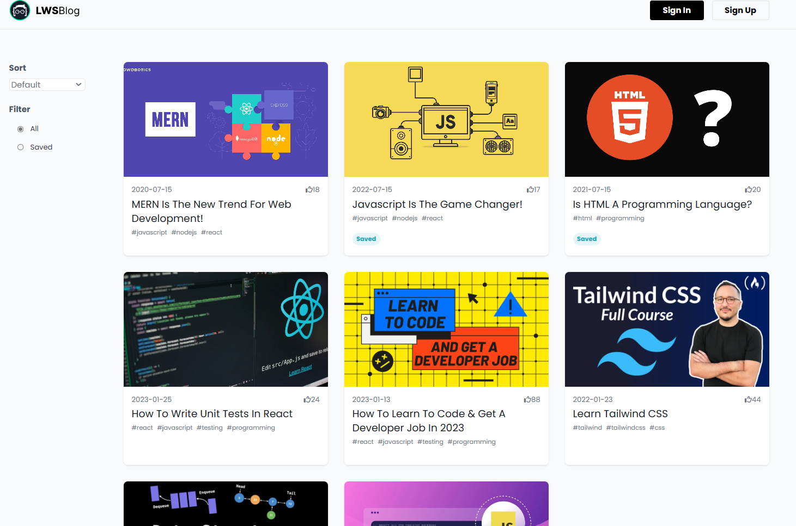

## Blog Application

### Live Preview [Preview](https://github)

### Technologies used in this application

    🠪 JavaScript
    🠪 ReactJs
    🠪 Redux-toolkit
    🠪 React router dom (for routing purposes)

### Functionality

✓ Fetch all the blog posts from the database and render them into the home page

✓ You can use sort them as per "Newest" or "Most Likeed" and also you can search the saved blog posts

✓ If you click on the Title or Thumbnail of the post you can the details of the post.here you can save or unsaved the post.also you can like the post but their is no authentication is used so you can as many as your wish.And this all sync to the database.

✓ In the Details page you can the see the related blog as depnent on the tags.

> **Note**
> In this project the server are used is a dummy local server.To start the server you have to download the "server" folder add install node dependency (e.x npm install) then start the server (e.x npm start).

### Web page screenshot

<table>
  <tr>
    <td>Home Page</td>
     <td>Blog Detail Page</td>
     
  </tr>
  <tr>
    <td></td>
    <td></td>
    
  </tr>
 </table>
